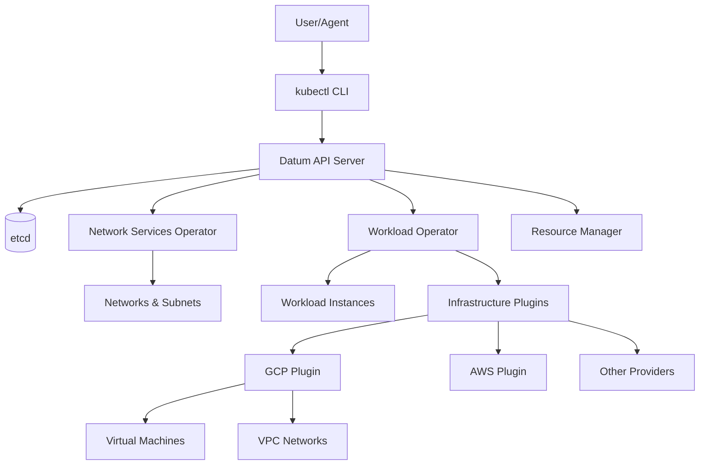
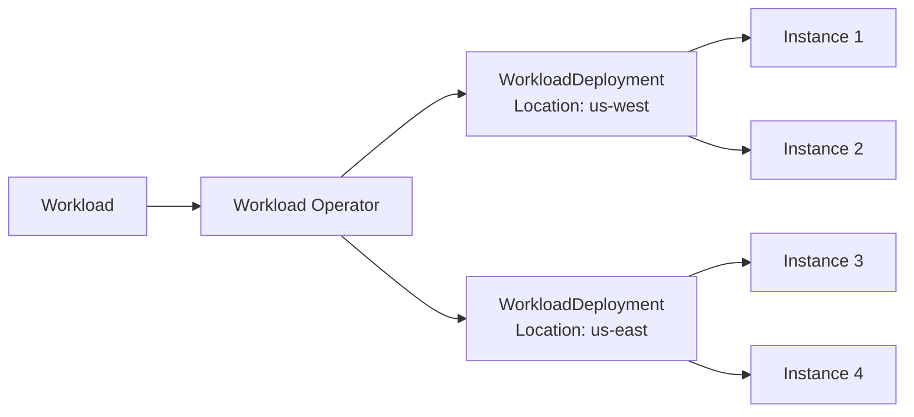
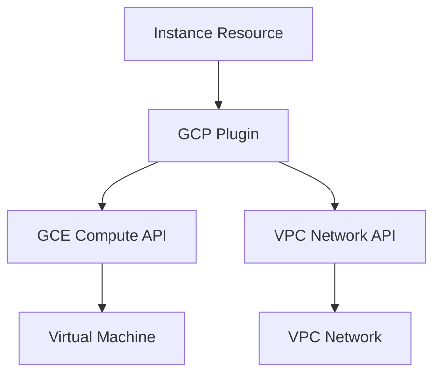

# System Architecture

Datum Cloud is built on Kubernetes principles, leveraging the Kubernetes API server and custom resource definitions (CRDs) to provide a declarative infrastructure control plane.

## Architecture Overview



## Core Components

### Datum API Server

The heart of Datum Cloud is a Kubernetes api-server deployed in the style of the [generic control plane (KEP-4080)](https://github.com/kubernetes/enhancements/tree/master/keps/sig-api-machinery/4080-generic-controlplane).

<Info>
**Why Kubernetes?** We leverage the vast ecosystem of Kubernetes libraries and tooling. There's no need to design a bespoke, infrastructure-focused distributed system for you to learn; Kubernetes has the primitives to support it.
</Info>

The Datum API server:
- Handles Datum-specific resources like `Network`, `Workload`, `Organization`, and `Project`
- Provides REST API endpoints for all resources
- Enforces RBAC and admission policies
- Stores state in etcd for consistency and reliability
- Supports watch operations for real-time updates

**Key Features:**
- **Declarative API**: Define desired state, operators reconcile
- **Custom Resources**: Extend Kubernetes with infrastructure primitives
- **Authentication & Authorization**: Integration with IAM for user management
- **Admission Control**: Validate and mutate resources before persistence

### Network Services Operator

The [Network Services Operator](https://github.com/datum-cloud/network-services-operator) manages networking primitives:

<CardGroup cols={2}>
  <Card title="VPC Networks" icon="network-wired">
    `Network` and `NetworkContext` resources for isolated networking environments
  </Card>
  <Card title="Subnets" icon="layer-group">
    `SubnetClaim` and `Subnet` for subnet allocation and management
  </Card>
  <Card title="IPAM" icon="hashtag">
    IP Address Management for automatic IP allocation
  </Card>
  <Card title="Network Policies" icon="shield-halved">
    `NetworkBinding` and `NetworkPolicy` for network security
  </Card>
</CardGroup>

**Responsibilities:**
- Watch for `Network` resource creation
- Allocate IP address ranges (IPAM)
- Create subnets based on claims
- Enforce network policies
- Coordinate with infrastructure plugins for VPC provisioning

### Workload Operator

The [Workload Operator](https://github.com/datum-cloud/workload-operator) manages compute resources:

**Key Responsibilities:**
- Watch for `Workload` resource creation
- Evaluate placement rules (where instances should run)
- Create `WorkloadDeployment` resources for each location
- Generate `Instance` resources from templates
- Handle scaling (replicas)
- Manage lifecycle (updates, deletions)

**Architecture:**


See the [Workloads RFC](https://github.com/datum-cloud/enhancements/tree/main/enhancements/compute/workloads) for detailed design information.

### Resource Manager

The Resource Manager provides organizational capabilities:

**Components:**

<Tabs>
  <Tab title="Organizations">
    Manage organizational hierarchies with two types:
    - **Personal**: Automatically created for each user (max 2 projects)
    - **Standard**: Multi-user organizations (max 10 projects)
  </Tab>
  
  <Tab title="Projects">
    Isolated workspaces for resources within organizations.
    
    Projects are automatically created:
    - Personal project when user signs up
    - Additional projects up to quota limits
  </Tab>
  
  <Tab title="Quota System">
    Enforce resource limits using:
    - `ResourceRegistration`: Define what can be limited
    - `GrantCreationPolicy`: Allocate quotas automatically
    - `ClaimCreationPolicy`: Enforce limits on creation
    - `ResourceGrant`: Quota allocations
    - `ResourceClaim`: Quota consumption
  </Tab>
</Tabs>

**Personal Organization Controller:**

Located in `internal/controller/resourcemanager/personal_organization_controller.go:60`, this controller automatically:

1. Creates a personal organization when a user signs up
2. Creates an `OrganizationMembership` granting Owner role
3. Creates a default personal project (impersonating the user)

```go
// From source code
_, err := controllerutil.CreateOrUpdate(ctx, r.Client, personalOrg, func() error {
    personalOrg.Spec.Type = "Personal"
    return nil
})
```

### Infrastructure Plugins

Plugins interpret resource definitions to manage provider-specific resources:

<CardGroup cols={2}>
  <Card title="GCP Plugin" icon="google" href="https://github.com/datum-cloud/infra-provider-gcp">
    First-class support for Google Cloud Platform
  </Card>
  <Card title="AWS Plugin" icon="aws" href="#">
    Support for Amazon Web Services (coming soon)
  </Card>
</CardGroup>

**GCP Plugin Features:**
- VM-based workload instances with OS images
- gVisor sandboxed container instances with OCI images
- VPC connectivity and IPAM
- Multi-network attachment for instances

**Plugin Architecture:**


## Data Flow

### Creating a Workload

Here's what happens when you create a `Workload` resource:

<Steps>
  <Step title="User submits resource">
    ```bash
    kubectl apply -f workload.yaml
    ```
  </Step>
  
  <Step title="API server validates">
    - Authentication: Verify user identity
    - Authorization: Check RBAC permissions
    - Admission: Run validation policies
    - Quota: Check quota limits
  </Step>
  
  <Step title="Resource persisted to etcd">
    The `Workload` resource is stored in etcd with status `Pending`.
  </Step>
  
  <Step title="Workload Operator reconciles">
    - Evaluate placement rules
    - Create `WorkloadDeployment` resources for each location
    - Generate `Instance` resources from template
  </Step>
  
  <Step title="Infrastructure plugin provisions">
    - Watch for `Instance` resources
    - Create VM or container in target provider (GCP, AWS, etc.)
    - Attach to network interfaces
  </Step>
  
  <Step title="Status updates">
    - Plugin updates `Instance` status to `Running`
    - Workload Operator updates `Workload` status to `Ready`
  </Step>
</Steps>

## Reconciliation Loop

Datum uses Kubernetes controller patterns for continuous reconciliation:

```go
// Simplified reconciliation logic
func (r *WorkloadReconciler) Reconcile(ctx context.Context, req ctrl.Request) (ctrl.Result, error) {
    // 1. Fetch the current state
    workload := &computev1alpha1.Workload{}
    if err := r.Get(ctx, req.NamespacedName, workload); err != nil {
        return ctrl.Result{}, client.IgnoreNotFound(err)
    }
    
    // 2. Calculate desired state
    desiredDeployments := calculatePlacement(workload)
    
    // 3. Reconcile to desired state
    for _, deployment := range desiredDeployments {
        if err := r.CreateOrUpdate(ctx, deployment); err != nil {
            return ctrl.Result{}, err
        }
    }
    
    // 4. Update status
    workload.Status.Ready = true
    return ctrl.Result{}, r.Status().Update(ctx, workload)
}
```

## High Availability

Datum Cloud is designed for high availability:

- **Leader Election**: Only one controller instance actively reconciles (configured in `config/manager/manager.yaml:76`)
- **Distributed Storage**: etcd provides distributed, consistent storage
- **Stateless Controllers**: Controllers can be restarted without data loss
- **Watch Resumption**: Controllers resume from last known state after restart

**Configuration from source:**

```yaml
# From config/manager/manager.yaml
- name: LEADER_ELECT
  value: "true"
- name: LEADER_ELECTION_LEASE_DURATION
  value: "15s"
- name: LEADER_ELECTION_RENEW_DEADLINE
  value: "10s"
- name: LEADER_ELECTION_RETRY_PERIOD
  value: "2s"
```

## Security Architecture

Security is built into every layer:

<CardGroup cols={2}>
  <Card title="Authentication" icon="key">
    IAM integration for user identity and GitHub OAuth
  </Card>
  <Card title="Authorization" icon="lock">
    Kubernetes RBAC with role-based access control
  </Card>
  <Card title="Admission Control" icon="shield-check">
    ValidatingAdmissionPolicy for resource validation
  </Card>
  <Card title="Network Encryption" icon="shield">
    Built-in encryption impossible to disable
  </Card>
</CardGroup>

For detailed security information, see [Security Best Practices](/operations/security).

## Scalability

Datum scales horizontally:

- **API Server**: Multiple replicas behind load balancer
- **Controllers**: Leader election ensures single active reconciler
- **Plugins**: Deployed per-provider with independent scaling
- **etcd**: Distributed consensus for data consistency

## Next Steps

<CardGroup cols={2}>
  <Card title="Core Concepts" icon="book" href="/concepts/networks">
    Deep dive into Networks, Workloads, and more
  </Card>
  <Card title="Deployment" icon="server" href="/deployment/installation">
    Learn how to install and configure Datum
  </Card>
  <Card title="Operations" icon="gears" href="/operations/managing-resources">
    Manage and monitor your Datum infrastructure
  </Card>
  <Card title="Enhancements" icon="lightbulb" href="https://link.datum.net/enhancements">
    Explore the roadmap and RFCs
  </Card>
</CardGroup>