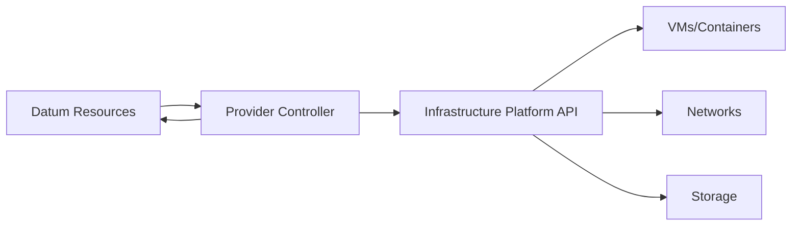

## Overview

Datum's plugin architecture allows you to extend the platform by building custom infrastructure provider plugins. Provider plugins are Kubernetes operators that reconcile Datum resources against any infrastructure platform or cloud provider.

<Info>
Custom providers follow the same patterns as the [official GCP provider](https://github.com/datum-cloud/infra-provider-gcp), which serves as a reference implementation.
</Info>

## Use Cases for Custom Providers

Build custom provider plugins to:

<CardGroup cols={2}>
  <Card title="Cloud Providers" icon="cloud">
    Integrate with AWS, Azure, DigitalOcean, Vultr, NetActuate, or other cloud platforms
  </Card>
  <Card title="On-Premises Infrastructure" icon="server">
    Manage bare metal servers, VMware vSphere, Proxmox, or OpenStack environments
  </Card>
  <Card title="Specialty Providers" icon="microchip">
    Integrate with edge computing platforms, IoT device management, or GPU clusters
  </Card>
  <Card title="Internal Systems" icon="building">
    Connect to internal provisioning systems, CMDBs, or legacy infrastructure
  </Card>
</CardGroup>

## Architecture Overview

A Datum infrastructure provider plugin is a Kubernetes controller that:

1. **Watches** Datum resources like `Workload`, `Network`, and `WorkloadDeployment`
2. **Interprets** placement rules and resource specifications
3. **Provisions** infrastructure resources in the target platform
4. **Reconciles** the actual infrastructure state to match the desired state
5. **Reports** status back to Datum resources



## Getting Started

<Steps>
  <Step title="Set up development environment">
    Install the required tools:

    ```bash
    # Install Go 1.21 or later
    go version

    # Install Kubebuilder for scaffolding
    curl -L -o kubebuilder https://go.kubebuilder.io/dl/latest/$(go env GOOS)/$(go env GOARCH)
    chmod +x kubebuilder && mv kubebuilder /usr/local/bin/

    # Install kubectl and kind for local testing
    # Follow https://kubernetes.io/docs/tasks/tools/
    ```
  </Step>

  <Step title="Scaffold the provider project">
    Create a new Kubernetes operator project:

    ```bash
    mkdir infra-provider-mycloud
    cd infra-provider-mycloud

    # Initialize a new Kubebuilder project
    kubebuilder init \
      --domain datum.net \
      --repo github.com/myorg/infra-provider-mycloud
    ```
  </Step>

  <Step title="Define custom resources">
    Create API types for provider-specific configuration:

    ```bash
    # Create ProviderConfig CRD
    kubebuilder create api \
      --group mycloud \
      --version v1alpha1 \
      --kind ProviderConfig \
      --resource --controller
    ```
  </Step>

  <Step title="Implement reconciliation logic">
    Add controllers to watch Datum resources and reconcile infrastructure.

    See the implementation guide below for details.
  </Step>
</Steps>

## Implementation Guide

### 1. Watch Datum Resources

Your provider needs to watch for Datum's core resources:

```go
package controller

import (
    workloadv1alpha1 "github.com/datum-cloud/workload-operator/api/v1alpha1"
    networkv1alpha1 "github.com/datum-cloud/network-services-operator/api/v1alpha1"
    ctrl "sigs.k8s.io/controller-runtime"
)

func (r *WorkloadReconciler) SetupWithManager(mgr ctrl.Manager) error {
    return ctrl.NewControllerManagedBy(mgr).
        For(&workloadv1alpha1.WorkloadDeployment{}).
        Owns(&workloadv1alpha1.Instance{}).
        Complete(r)
}
```

### 2. Implement Workload Reconciliation

Handle workload provisioning in your target infrastructure:

```go
func (r *WorkloadReconciler) Reconcile(ctx context.Context, req ctrl.Request) (ctrl.Result, error) {
    // Fetch the WorkloadDeployment
    var deployment workloadv1alpha1.WorkloadDeployment
    if err := r.Get(ctx, req.NamespacedName, &deployment); err != nil {
        return ctrl.Result{}, client.IgnoreNotFound(err)
    }

    // Get provider configuration
    providerConfig, err := r.getProviderConfig(ctx, &deployment)
    if err != nil {
        return ctrl.Result{}, err
    }

    // Initialize infrastructure client
    infraClient, err := r.newInfraClient(providerConfig)
    if err != nil {
        return ctrl.Result{}, err
    }

    // Reconcile instances
    if deployment.Spec.Template.Spec.Containers != nil {
        return r.reconcileContainerInstances(ctx, &deployment, infraClient)
    } else {
        return r.reconcileVMInstances(ctx, &deployment, infraClient)
    }
}
```

### 3. Handle Container Instances

Provision container-based workloads:

```go
func (r *WorkloadReconciler) reconcileContainerInstances(
    ctx context.Context,
    deployment *workloadv1alpha1.WorkloadDeployment,
    client InfraClient,
) (ctrl.Result, error) {
    
    // Extract container specs
    containers := deployment.Spec.Template.Spec.Containers
    
    // Create instances in infrastructure
    for i := 0; i < deployment.Spec.Replicas; i++ {
        instanceName := fmt.Sprintf("%s-%d", deployment.Name, i)
        
        // Check if instance already exists
        existing, err := client.GetInstance(ctx, instanceName)
        if err == nil {
            // Update existing instance if needed
            if needsUpdate(existing, containers) {
                err = client.UpdateInstance(ctx, instanceName, containers)
            }
        } else {
            // Create new instance
            err = client.CreateContainerInstance(ctx, instanceName, containers)
        }
        
        if err != nil {
            return ctrl.Result{}, err
        }
        
        // Create Datum Instance resource
        instance := &workloadv1alpha1.Instance{
            ObjectMeta: metav1.ObjectMeta{
                Name:      instanceName,
                Namespace: deployment.Namespace,
            },
            Spec: workloadv1alpha1.InstanceSpec{
                WorkloadRef: deployment.Name,
                Provider:    "mycloud",
            },
        }
        
        if err := r.Create(ctx, instance); err != nil {
            return ctrl.Result{}, err
        }
    }
    
    return ctrl.Result{}, nil
}
```

### 4. Handle VM Instances

Provision virtual machine instances:

```go
func (r *WorkloadReconciler) reconcileVMInstances(
    ctx context.Context,
    deployment *workloadv1alpha1.WorkloadDeployment,
    client InfraClient,
) (ctrl.Result, error) {
    
    // Extract VM specs
    image := deployment.Spec.Template.Spec.Image
    machineType := deployment.Spec.Template.Spec.MachineType
    
    // Create VM instances
    for i := 0; i < deployment.Spec.Replicas; i++ {
        instanceName := fmt.Sprintf("%s-%d", deployment.Name, i)
        
        vmSpec := &VMSpec{
            Name:        instanceName,
            Image:       image,
            MachineType: machineType,
            Networks:    deployment.Spec.Template.Spec.Networks,
        }
        
        // Provision VM in infrastructure
        vmID, err := client.CreateVM(ctx, vmSpec)
        if err != nil {
            return ctrl.Result{}, err
        }
        
        // Create Datum Instance resource with provider-specific ID
        instance := &workloadv1alpha1.Instance{
            ObjectMeta: metav1.ObjectMeta{
                Name:      instanceName,
                Namespace: deployment.Namespace,
            },
            Spec: workloadv1alpha1.InstanceSpec{
                WorkloadRef: deployment.Name,
                Provider:    "mycloud",
            },
            Status: workloadv1alpha1.InstanceStatus{
                ProviderID: vmID,
                Phase:      "Running",
            },
        }
        
        if err := r.Create(ctx, instance); err != nil {
            return ctrl.Result{}, err
        }
    }
    
    return ctrl.Result{}, nil
}
```

### 5. Implement Network Reconciliation

Handle VPC/network creation:

```go
func (r *NetworkReconciler) Reconcile(ctx context.Context, req ctrl.Request) (ctrl.Result, error) {
    var network networkv1alpha1.Network
    if err := r.Get(ctx, req.NamespacedName, &network); err != nil {
        return ctrl.Result{}, client.IgnoreNotFound(err)
    }

    // Create VPC in infrastructure
    vpcID, err := r.infraClient.CreateVPC(ctx, &VPCSpec{
        Name: network.Name,
        CIDR: network.Spec.CIDR,
    })
    if err != nil {
        return ctrl.Result{}, err
    }

    // Create subnets
    for _, subnet := range network.Spec.Subnets {
        _, err := r.infraClient.CreateSubnet(ctx, &SubnetSpec{
            Name:   subnet.Name,
            VPCID:  vpcID,
            CIDR:   subnet.CIDR,
            Region: subnet.Region,
        })
        if err != nil {
            return ctrl.Result{}, err
        }
    }

    // Update network status
    network.Status.ProviderID = vpcID
    network.Status.Phase = "Ready"
    return ctrl.Result{}, r.Status().Update(ctx, &network)
}
```

## Provider Configuration

Define a `ProviderConfig` custom resource for provider-specific settings:

```go
type ProviderConfigSpec struct {
    // Provider-specific credentials
    Credentials CredentialsSpec `json:"credentials"`
    
    // Default region
    Region string `json:"region,omitempty"`
    
    // Provider-specific configuration
    // For AWS: accountID, vpcID
    // For Azure: subscriptionID, resourceGroup
    Config map[string]string `json:"config,omitempty"`
}

type CredentialsSpec struct {
    Source string `json:"source"` // "Secret" or "InjectedIdentity"
    
    SecretRef *SecretReference `json:"secretRef,omitempty"`
}
```

Users configure the provider with:

```yaml
apiVersion: mycloud.datum.net/v1alpha1
kind: ProviderConfig
metadata:
  name: default
spec:
  credentials:
    source: Secret
    secretRef:
      name: mycloud-credentials
      namespace: datum-system
      key: credentials.json
  region: us-west-2
  config:
    accountID: "123456789012"
```

## Testing Your Provider

<Steps>
  <Step title="Unit tests">
    Write unit tests for reconciliation logic:

    ```go
    func TestWorkloadReconcile(t *testing.T) {
        // Use controller-runtime's envtest
        // Test workload creation, updates, and deletion
    }
    ```
  </Step>

  <Step title="Integration tests">
    Test against a real Kubernetes cluster:

    ```bash
    # Create a kind cluster
    kind create cluster

    # Install CRDs
    make install

    # Run the controller locally
    make run

    # In another terminal, apply test resources
    kubectl apply -f examples/workload.yaml
    ```
  </Step>

  <Step title="End-to-end tests">
    Verify full integration with your infrastructure platform:

    ```bash
    # Deploy provider to cluster
    make deploy

    # Apply test workloads and verify infrastructure is created
    kubectl apply -f examples/
    
    # Check instance status
    kubectl get instances -A
    ```
  </Step>
</Steps>

## Deployment

Package your provider as a Kubernetes deployment:

```yaml
apiVersion: apps/v1
kind: Deployment
metadata:
  name: mycloud-provider
  namespace: datum-system
spec:
  replicas: 1
  selector:
    matchLabels:
      app: mycloud-provider
  template:
    metadata:
      labels:
        app: mycloud-provider
    spec:
      serviceAccountName: mycloud-provider
      containers:
        - name: manager
          image: myorg/infra-provider-mycloud:v1.0.0
          command:
            - /manager
          args:
            - --leader-elect
          env:
            - name: PROVIDER_NAME
              value: mycloud
```

## Best Practices

<AccordionGroup>
  <Accordion title="Handle errors gracefully">
    - Return errors to trigger reconciliation retries
    - Use exponential backoff for transient failures
    - Update resource status with error messages
    - Log detailed error information for debugging
  </Accordion>

  <Accordion title="Implement idempotent operations">
    - Check if resources already exist before creating
    - Support updates to existing infrastructure
    - Handle partial failures gracefully
    - Use provider-specific IDs to track resources
  </Accordion>

  <Accordion title="Report accurate status">
    - Update Datum resource status with provider IDs
    - Report instance health and readiness
    - Include IP addresses and network information
    - Set appropriate conditions for observability
  </Accordion>

  <Accordion title="Support cleanup">
    - Implement finalizers to clean up infrastructure
    - Delete provider resources when Datum resources are deleted
    - Handle cascading deletions correctly
    - Prevent orphaned resources in the infrastructure
  </Accordion>
</AccordionGroup>

## Reference Implementation

The [official GCP provider](https://github.com/datum-cloud/infra-provider-gcp) serves as a complete reference implementation. Study its code to understand:

- Project structure and organization
- API definitions and CRDs
- Controller reconciliation patterns
- Status reporting and error handling
- Testing strategies
- Deployment configurations

## Next Steps

<CardGroup cols={2}>
  <Card title="GCP Provider Source" icon="github" href="https://github.com/datum-cloud/infra-provider-gcp">
    Study the official GCP provider implementation
  </Card>
  <Card title="Workload Operator" icon="github" href="https://github.com/datum-cloud/workload-operator">
    Understand the Workload API your provider implements
  </Card>
  <Card title="Network Services Operator" icon="github" href="https://github.com/datum-cloud/network-services-operator">
    Learn about Network resource management
  </Card>
  <Card title="Enhancements" icon="lightbulb" href="https://link.datum.net/enhancements">
    Propose new provider features or integrations
  </Card>
</CardGroup>
